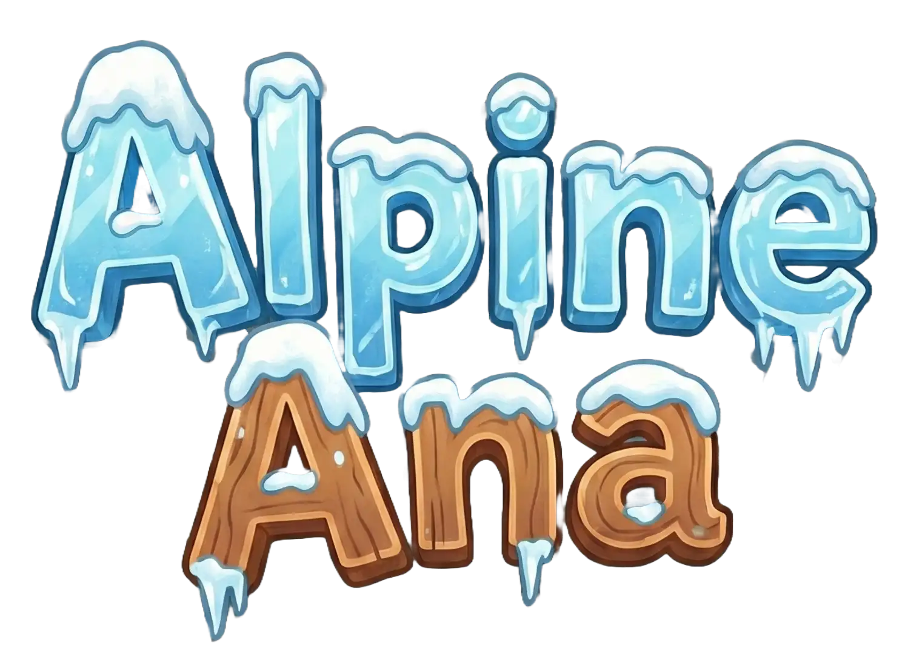

# Alpine Ana 🎿

A 3D endless skiing game built with Three.js. Ski down an infinite mountain slope, avoid obstacles, collect gifts, and try to beat your high score!



## 🎮 Features

- **3D Graphics**: Immersive spherical world built with Three.js
- **Endless Gameplay**: Procedurally generated obstacles and boundaries
- **Smooth Controls**: Responsive keyboard and touch controls
- **Progressive Difficulty**: Speed increases as you progress
- **Lives System**: 3 lives to survive as long as possible
- **Score Tracking**: Track your distance and compete for high scores
- **Gift Collection**: Collect special gifts during gameplay
- **Animations**: Smooth skiing, jumping, turning, and crash animations
- **Audio**: Background music, ambient sounds, and sound effects
- **Mobile Support**: Fully optimized for mobile devices with swipe controls
- **PWA Ready**: Installable Progressive Web App

## 🎯 Gameplay

### Objective
Ski down the mountain as far as possible while avoiding obstacles. You have 3 lives - use them wisely!

### Controls

**Desktop:**
- `←` / `A` - Move left
- `→` / `D` - Move right
- `↑` / `W` / `Space` - Jump

**Mobile:**
- Swipe left/right - Change lanes
- Swipe up - Jump

### Game Mechanics

- **Lanes**: Move between lanes to avoid obstacles
- **Jumping**: Jump over obstacles and barriers
- **Collisions**: Hitting obstacles costs a life
- **Speed**: Game speed gradually increases
- **Gifts**: Collect gifts for special rewards
- **Score**: Based on distance traveled

## 🚀 Getting Started

### Prerequisites

- Node.js (v16 or higher)
- npm or yarn

### Installation

1. Clone the repository:
```bash
git clone <repository-url>
cd ski
```

2. Install dependencies:
```bash
npm install
```

3. Start the development server:
```bash
npm run dev
```

4. Open your browser and navigate to `http://localhost:5173`

### Building for Production

```bash
npm run build
```

The built files will be in the `dist` directory.

### Preview Production Build

```bash
npm run preview
```

## 📁 Project Structure

```
ski/
├── index.html          # Main game file
├── pose-editor.html    # Pose editor tool
├── public/             # Static assets
│   ├── assets/
│   │   ├── audio/     # Sound effects and music
│   │   ├── images/    # UI images and icons
│   │   └── models/     # 3D GLB models
│   └── manifest.json   # PWA manifest
├── src/                # Source files (legacy)
├── styles/             # CSS styles
├── vite.config.js      # Vite configuration
├── vercel.json         # Vercel deployment config
└── package.json        # Dependencies and scripts
```

## 🛠️ Development

### Key Technologies

- **Three.js r128**: 3D graphics and rendering
- **Vite**: Build tool and dev server
- **Vanilla JavaScript**: No framework dependencies
- **GLTF/GLB**: 3D model format

### Configuration

Game settings can be adjusted in the `CONFIG` object in `index.html`:

```javascript
const CONFIG = {
  baseSpeed: 0.003,
  maxSpeed: 0.006,
  accelerationRate: 0.000001,
  turnSpeed: 0.25,
  worldRadius: 100,
  spawnInterval: 0.18,
  laneWidth: 5,
  gravity: 0.06,
  jumpStrength: 0.7,
  // ... more settings
};
```

### Pose Editor

Access the pose editor tool at `/pose-generator` to customize skier animations and poses. This tool allows you to:

- Adjust bone rotations
- Preview animations
- Copy pose code for use in the game
- Test different skiing poses

## 🎨 Customization

### Audio

Audio files are located in `public/assets/audio/`:
- `music.mp3` - Background music
- `jump.mp3` - Jump sound effect
- `snow-sliding.mp3` - Ambient skiing sound
- `ouch_*.mp3` - Crash sound effects
- `twinkle.mp3` - Gift collection sound
- And more...

### 3D Models

GLB models are in `public/assets/models/`:
- `skier_v1.glb` - Player character
- `alpine_tree_v1.glb` - Obstacle trees
- `rock_v1.glb` - Rock barriers
- `wooden_fence_v1.glb` - Boundary fences
- `red_sign_v1.glb` / `blue_sign_v1.glb` - Warning signs
- `gift_v1.glb` - Collectible gifts

## 📱 Mobile Optimization

The game is fully optimized for mobile devices:

- Touch-friendly controls with swipe gestures
- Responsive UI that adapts to screen size
- Optimized collision detection for mobile performance
- PWA support for app-like experience
- Prevents text selection and context menus during gameplay

## 🚢 Deployment

### Vercel

The project is configured for Vercel deployment:

1. Push to your Git repository
2. Import project in Vercel
3. Vercel will automatically detect the configuration

The `vercel.json` includes:
- Build configuration
- Route rewrites for `/pose-generator`

### Other Platforms

For other hosting platforms, build the project and serve the `dist` directory:

```bash
npm run build
```

Then deploy the `dist` folder to your hosting provider.

## 🎮 Game Settings

Access the settings menu (⚙️ button) to toggle:

- **Music**: Background music on/off
- **Ambient Sound**: Environmental sounds
- **Sound Effects**: Game action sounds
- **Camera Controls**: Debug camera controls (optional)

## 🐛 Debug Mode

Enable camera controls in settings to access the debug panel, which shows:

- Camera position and rotation
- Player position and rotation
- Skier bone controls
- Real-time values

## 📝 License

See [LICENSE](LICENSE) file for details.

## 🙏 Acknowledgments

- Built with [Three.js](https://threejs.org/)
- Bundled with [Vite](https://vitejs.dev/)
- Deployed on [Vercel](https://vercel.com/)

---

**Enjoy skiing! 🎿⛷️**

